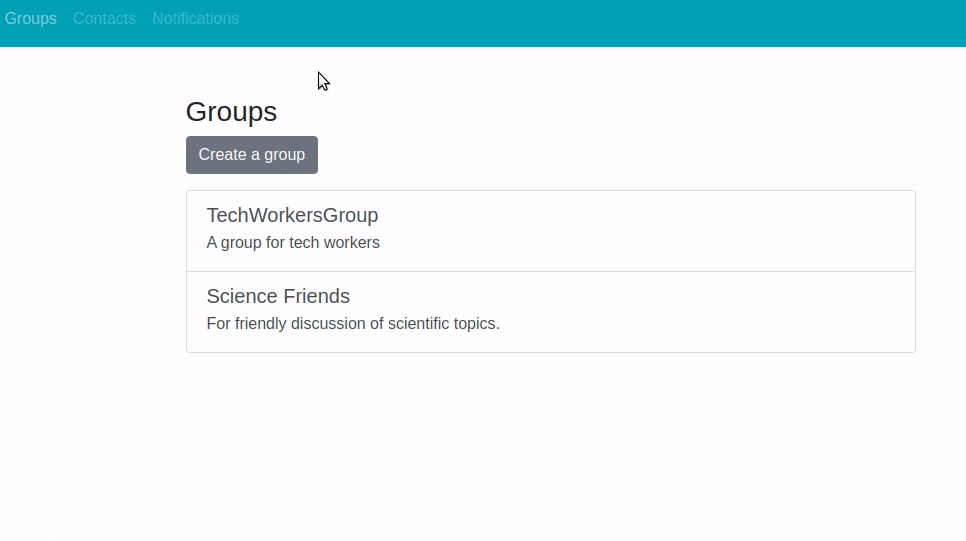
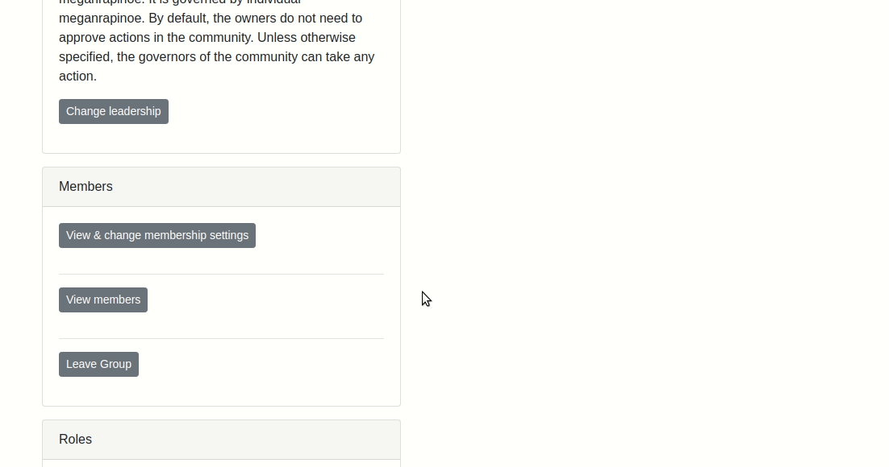
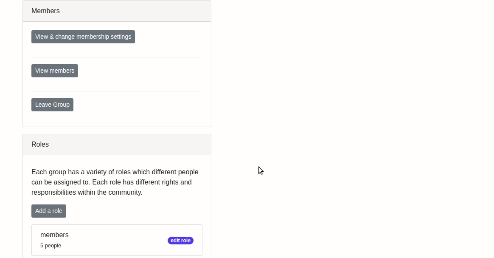
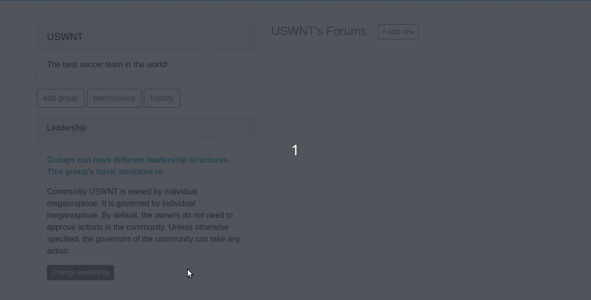
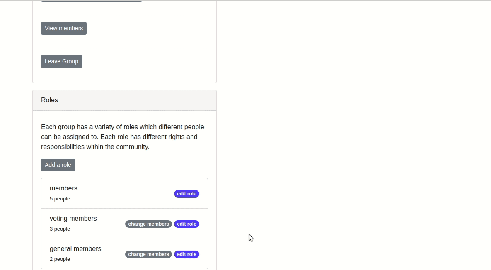
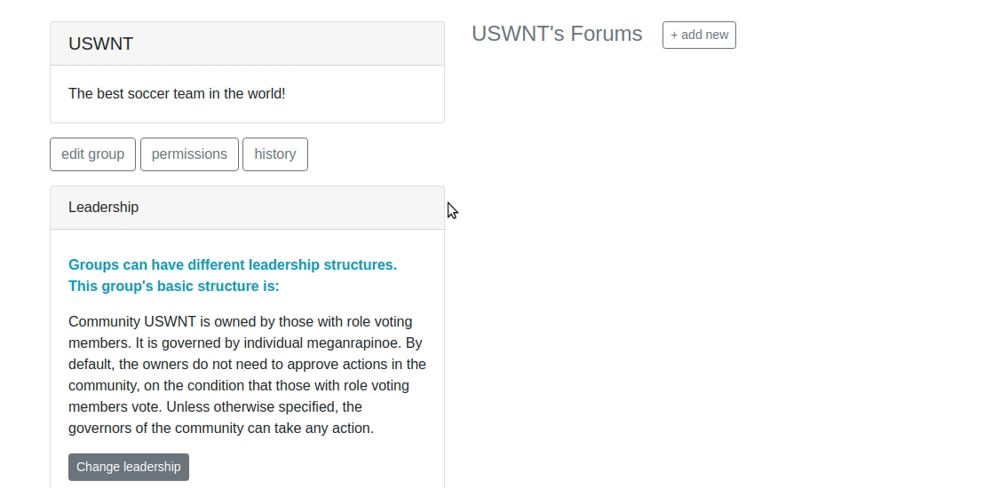
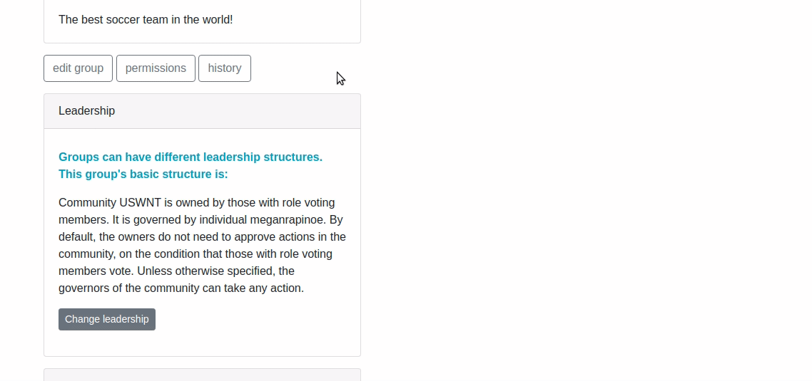

Example Implementation
----------------------

It may be helpful to look at a concrete implementation.  Shown below is just one possible implementation of Concord, of the many that the library has been designed to encompass.

This walkthrough demonstrates Concord as implemented on our prototype website, Kybern.org.  If you would like access to Kybern.org as a beta user, please contact us.  Here we cover a simple series of actions demonstrating some of the concepts discussed in the design section.

1: A user creates a new group.  By default, she is added as both owner and governor:

2: The user, using her governing permission, adds new members to the group.

3: The user, using her governing permission, creates new roles and adds those new members to roles.

4: The user assigns one of the roles, voting members, to be the new owner.  She adds a voting condition.

5: The user gives the other role, general members, permission to change the description of the group.  She adds an approval condition from a voting member.

6: A general member tries to change the name of the group.  There’s a condition on their action.  We go to the action history and see that it’s waiting.

7: A voting member goes and has the ability.  They approve.  We check and see that the action is implemented and the name is different now.

