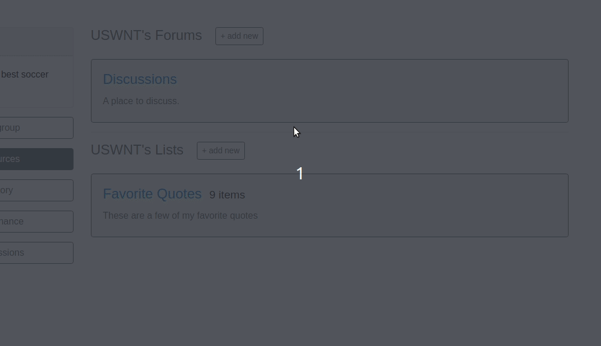

How to Add a Resource
#####################

"Resources" is our catch-all term for objects which descend from PermissionedModel, excluding a few core objects like permissions, conditions and communities.  Comments are a resource, for instance, as are forums and posts.

In order to show you how to add your own resources, we'll walk you through how we added the List resource. The steps are:

#. Create a new Django model inheriting from PermissionedModel, with any fields you like. Make sure to implement any required methods.
#. Think through however you'd like people to interact with the resource, and then write state changes for each action type.
#. Create a client for your resource following the pattern of existing clients, adding methods for each of the state changes as well as methods for getting information about your resource.
#. Create the Django views (& linked urls) which call that method and return the results as Javascript.
#. Create one or more Vue components (and corresponding Vuex storage and Vue-router references) for users to interact with.

This sounds like a lot, but it's relatively straightforward.  Let's dive in.

Create a new model
******************

We begin by creating a Django model for our new resource, Lists. This model can go in any ``models.py`` as long as it's an installed app, and Concord's system will automatically detect it.  

Our lists will have names and descriptions, but we also want to store list item data. We'll do so in a ``rows`` field.  We use Django's TextField for this as, by default, the TextField's maximum length is None, and we may want to fit a *lot* of rows in our table.

.. code-block:: python

    from concord.actions.models import PermissionedModel

    class SimpleList(PermissionedModel):

        name = models.CharField(max_length=200)
        description = models.CharField(max_length=200)
        rows = models.TextField(default=dict)

We can't save a Python dictionary straight to the database, though.  We need to serialize it and deserialize it using Json.  We'll also create a few helper methods for adding, editing and removing rows. We'll give our add_row method an optional index argument. If an index is supplied, we'll add the row at that location, otherwise we'll just append it to the end. Conversely, the index will be required when editing and deleting rows.

.. code-block:: python

    import json
    from concord.actions.models import PermissionedModel

    class SimpleList(PermissionedModel):

        name = models.CharField(max_length=200)
        description = models.CharField(max_length=200)
        rows = models.TextField(default=list)

        def get_rows(self):
            return json.loads(self.rows)
        
        def add_row(self, row, index=None):
            rows = self.get_rows()
            if index or index == 0:
                rows.insert(index, row)
            else:
                rows.append(row)
            self.rows = json.dumps(rows)

        def edit_row(self, row, index):
            rows = self.get_rows()
            rows[index] = row
            self.rows = json.dumps(rows)

        def delete_row(self, index):
            rows = self.get_rows()
            rows.pop(index)
            self.rows = json.dumps(rows)

Note that we're not saving our changes here.  A PermissionedModel can only be saved by a call within a State Change's implement method.

If you look at the PermissionedModel definition in `concord.actions.models`, you'll see a few fields and a number of methods defined. These are inherited automatically by our model - we don't need to do anything to make them work, with one exception.  We'll also inherit a few fields that way: the generic foreign key to the model's ``owner``, and the booleans ``foundational_permission_enabled`` and ``governing_permission_enabled``.

One method you may actually want to overwrite is ``get_nested_objects``.  Nested objects are anything our object might be placed 'within', and are referenced when looking up permissions that might control access to a model instance. For example, a Post is nested within a Forum and a Community, so `get_nested_objects` would include Forum and the community that owns it. This allows users to create a permission on the Forum applying to all posts within the Forum.  Let's update our model to overwrite this method, and return the Community that owns the List.

.. code-block:: python

    import json
    from concord.actions.models import PermissionedModel
    from concord.communities.models import Community

    class SimpleList(PermissionedModel):

        name = models.CharField(max_length=200)
        description = models.CharField(max_length=200)
        rows = models.TextField(list)

    def get_rows(self):
        return json.loads(self.rows)
    
    def add_row(self, row):
        rows = self.get_rows()
        rows.append(row)
        self.rows = json.dumps(rows)

    def delete_row(self, index):
        rows = self.get_rows()
        rows.pop(index)
        self.rows = json.dumps(rows)

    def get_nested_objects(self):
        return [self.get_owner()]

This is enough detail for now.  We'll come back later to add a bit more functionality to our SimpleList model.

Once you finish your model, you can make and run migrations.

Write State Changes
*******************

To create State Changes, think about the types of changes users might want to make to your model. For our SimpleList, the main thing they'll want to do is add and delete rows. They may also want to edit a row.  They may want to edit the name or description of the list, or delete the list entirely. And of course to do any of this they'll probably want to create a list in the first place.

This gives us six types of actions:

* add list
* edit list
* delete list
* add row
* edit row
* delete row

This gives us six State Changes to write. Let's start with "add list". We create our first State Change in a file called ``state_changes.py``, by inheriting from ``BaseStateChange``. Again, as long as the file has the right name and is within an installed app, the system should find and use it automatically.

There are a number of methods we'll have to write for the State Change, shown here as stubs.

.. code-block:: python

    from concord.actions.state_changes import BaseStateChange

    class AddListStateChange(BaseStateChange):
        description = ""
        input_fields = []

        def __init__(self):
            ...

        def get_settable_classes(self):
            ...

        def description_present_tense(self):
            ...

        def description_past_tense(self):
            ...

        def validate(self, actor, target):
            ...
            
        def implement(self, actor, target):
            ...

Let's start with ``__init__``. When we initialize our State Change, we need to pass into it any information about the change we want to make. In this case, that's the name and description of the list we want to create. We'll make the name required and the description optional:

.. code-block:: python

    def __init__(self, name, description=None):
        self.name = name
        self.description = description if description else ""

That's it! The next thing we're going to do is validate our input in the ``validate`` method. This method returns True or False and is called when starting to process an Action. If this method returns False, the process is aborted and an error message returned to the user. Otherwise, processing continues.

Basic validation is taken care of automatically in the validation method defined on BaseStateChange. That method checks whether the target of the action is one of the State Change's allowable targets, and whether the data supplied for individual fields can actually be saved to their corresponding model fields. If you want to add additional validation, you'll make a super call within the method, like so:

.. code-block:: python

    def validate(self, actor, target):
        if not super().validate(actor=actor, target=target):
            return False
        # Additional validation goes here

Because we don't need to do any extra validation, we can ommit the implementation of ``validate`` entirely and just use the parent class's method. However we do want to make sure that validate method has the data it needs. So we need to add two additional things - one class method (``get_allowable_targets``) one attribute (``input_fields``).

``get_allowable_targets`` indicates which models a change may be applied to. By default, all permissioned models in the entire system are allowable, but we want to override that to indicate only communities may be targets:

.. code-block:: python

    @classmethod
    def get_allowable_targets(cls):
        return cls.get_community_models()

We also want to specify which of the fields on the model are ``input_fields`` which correspond to model fields. The default validate method will look for any fields listed in ``input_fields`` and check whether the value supplied for it is valid, using Django's inbuilt ``clean`` method.  We can add our two fields ``name`` and ``description``, which both correspond to model fields, to the class-level attribute.  In some cases, the data we're providing is not meant to be applied directly to the target (for instance, if we are adding a permission to a target, the supplied fields need to be validated against the Permission model, not the target model). In that case, we'd set ``input_target`` to the relevant model, but we don't need to do that here.

.. code-block:: python

    class AddListStateChange(BaseStateChange):
        description = ""
        input_fields = ["name", "description"]

The last major method is ``implement``. This is where we actually save changes to the database. It's called after the action is validated and after it's passed the permissions pipeline. Because this state change adds a list, we'll need to create an instance of our SimpleList model. We feed in the name and description we recieved in ``__init__`` along with specifying that the owner of the SimpleList should be the owner of the group or resource we're adding it to. Note also that we return the created object to the caller.

.. code-block:: python

    from concord.resources.models import SimpleList

    def implement(self, actor, target):
        return SimpleList.objects.create(name=self.name, description=self.description, 
            owner=target.get_owner())       

Finally, we have three simpler methods.  

In ``get_settable_classes``, we indicate which models a permission may be set on. This overlaps with, but is not identical to, allowable targets. Take for example an Edit List State Change. The target of "edit list" has to be limited to lists, but we might still want to set permissions at the level of a community, so we can say a user can edit all lists in a given community. By default ``get_settable_classes`` returns whatever we specified in ``get_allowable_targets``.  This works just fine for this particular State Change, so we don't need to implement the method.

The last two methods create human-readable descriptions of the state changes, in past and present tense. They pair with the ``description`` attribute set on the class itself to help our users understand what the state change does.  The ``description`` attribute contains no instance-specific data, while ``description_present_tense`` and ``description_past_tense`` do incorporate it:

.. code-block:: python

    def description_present_tense(self):
        return f"add list with name {self.name}"

    def description_past_tense(self):
        return f"added list with name {self.name}"

Putting this all together, we get the code for our Add List state change:

.. code-block:: python

    from concord.resources.models import SimpleList

    class AddListStateChange(BaseStateChange):
        """State Change to create a list in a community (or other target)."""
        description = "Add list"
        input_fields = ["name", "description"]

        def __init__(self, name, description=None):
            self.name = name
            self.description = description if description else ""

        @classmethod
        def get_allowable_targets(cls):
            return cls.get_community_models()

        def description_present_tense(self):
            return f"add list with name {self.name}"

        def description_past_tense(self):
            return f"added list with name {self.name}"

        def implement(self, actor, target):
            return SimpleList.objects.create(name=self.name, description=self.description, 
                owner=target.get_owner())

Let's take a look at another state change, Edit List:

.. code-block:: python

    class EditListStateChange(BaseStateChange):
        """State Change to edit an existing list."""
        description = "Edit list"
        input_fields = ["name", "description"]

        def __init__(self, name=None, description=None):
            self.name = name
            self.description = description if description else ""

        def get_allowable_targets(self):
            return [SimpleList]

        def get_settable_classes(self):
            return self.get_community_models() + [SimpleList]

        def description_present_tense(self):
            return f"edit list with new name {self.name} and new description {self.description}"

        def description_past_tense(self):
            return f"edited list with new name {self.name} and new description {self.description}"

        def validate(self, actor, target):
            if not super().validate(actor=actor, target=target):
                return False
            if not self.name and not self.description:
                self.set_validation_error(message="Must supply new name or description when editing List.")
                return False
            return True

        def implement(self, actor, target):
            target.name = self.name if self.name else target.name
            target.description = self.description if self.description else target.description
            target.save()
            return target

Note that name is now optional too, as the state change allows us to edit the name or the description, or both. In ``validate``, we'll add some custom validation to make sure the user is supplying at least one of those two fields.

Our allowable target is now only the SimpleList model, but our settable classes include any community model the list might belong to, as well as the list model itself.

Finally, the implement method looks up the List we want to change and edits the appropriate fields. If the user didn't specify a new value for a field, we just use the old value. Once again, we return the list instance from the implement method.

Let's do one more state change, Add Row.

.. code-block:: python

    class AddRowStateChange(BaseStateChange):
        """State Change to add a row to a list."""
        description = "Add row to list"

        def __init__(self, row_content, index=None):
            self.row_content = row_content
            self.index = index

        @classmethod
        def get_allowable_targets(cls):
            return [SimpleList]

        def get_settable_classes(self):
            return self.get_community_models() + [SimpleList]

        def description_present_tense(self):
            return f"add row with content {self.row_content}"

        def description_past_tense(self):
            return f"added row with content {self.row_content}"

        def validate(self, actor, target):
            if not super().validate(actor=actor, target=target):
                return False
            if not isinstance(self.row_content, str):
                self.set_validation_error(message="Row content must be a string.")
                return False
            if self.index and not isinstance(self.index, int):
                self.set_validation_error(message="Index must be an integer.")
                return False
            return True

        def implement(self, actor, target):
            target.add_row(self.row_content, self.index)
            target.save()
            return target

Here we make use of the ``add_row`` method we wrote for our model. Note that we do not need to validate whether the index is valid as the ``list.insert()`` call we make in that method does not raise index errors. Instead, it interprets any negative integer indexes as "put this at the front of the list" and any too-high positive value indexes as "put this in the back of the list". That behavior works fine here, so we don't need to add any extra validation for it.

Go ahead and implement Delete List, Edit Row, and Delete Row yourself, and we'll be ready to move on to the next step.

Add a Client
************

We use clients to interact with state changes. This helps maintain a layer of abstraction, and makes it easier for users to utilize state changes without having to remember the name of each one.  When creating our client,we inherit from BaseClient, which provides many of the basic and helper methods that clients use. All we need to do is create the methods specific to our model. Let's create the client with stubs again:

.. code-block:: python

    from concord.actions.client import BaseClient

    class ListClient(BaseClient):
        """Client for interacting with Lists."""

        # Read methods

        def get_list(self, pk):
            ...

        def get_all_lists(self):
            ...

        def get_all_lists_given_owner(self, owner):
            ...

        # State changes

        def add_list(self, name, description=None):
            ...

        def edit_list(self, name=None, description=None):
            ...

        def delete_list(self):
            ...

        def add_row(self, row_content, index=None):
            ...

        def edit_row(self, row_content, index):
            ...
        
        def delete_row(self, index):
            ...

The read methods are straightforward - we merely use the Django models to get the appropriate data:

.. code-block:: python

    def get_list(self, pk):
        return SimpleList.objects.get(pk=pk)

    def get_all_lists(self):
        return SimpleList.objects.all()

    def get_all_lists_given_owner(self, owner):
        content_type = ContentType.objects.get_for_model(owner)
        return SimpleList.objects.filter(
            owner_content_type=content_type,owner_object_id=owner.id)

State Change methods follow a very specific format.  First, you want to instantiate a State Change object using the parameters passed in, and then you want to call BaseClient's method ``create_and_take_action``. Typically, we import all state changes as ``sc`` for easy reference.  This gives us a client that looks like this:

.. code-block:: python

    from django.contrib.contenttypes.models import ContentType
    from concord.resources.models import SimpleList
    from concord.resources import state_changes as sc
    from concord.actions.client import BaseClient

    class ListClient(BaseClient):
        """Client for interacting with Lists."""

        # Read methods

        def get_all_lists(self):
            return SimpleList.objects.all()

        def get_all_lists_given_owner(self, owner):
            content_type = ContentType.objects.get_for_model(owner)
            return SimpleList.objects.filter(
                owner_content_type=content_type,owner_object_id=owner.id)

        # State changes

        def add_list(self, name, description=None):
            change = sc.AddListStateChange(name=name, description=description)
            return self.create_and_take_action(change)

        def edit_list(self, name=None, description=None):
            change = sc.EditListStateChange(name=name, description=description)
            return self.create_and_take_action(change)

        def delete_list(self):
            change = sc.DeleteListStateChange()
            return self.create_and_take_action(change)

        def add_row(self, row_content, index=None):
            change = sc.AddRowStateChange(row_content=row_content, index=index)
            return self.create_and_take_action(change)

        def edit_row(self, row_content, index):
            change = sc.EditRowStateChange(row_content=row_content, index=index)
            return self.create_and_take_action(change)
        
        def delete_row(self, index):
            change = sc.DeleteRowStateChange(index=index)
            return self.create_and_take_action(change)

Add Urls & Views
****************

Our front end will not be directly interacting with our client, so the next step is to build urls & views that correspond to our methods. We can often create one url-view pair for each method. Our urls will look something like this.

.. code-block:: python

    # list views
    path('api/<int:target>/get_lists/', views.get_lists, name='get_lists'),
    path('api/<int:target>/add_list/', views.add_list, name='add_list'),
    path('api/<int:target>/edit_list/', views.edit_list, name='edit_list'),
    path('api/<int:target>/delete_list/', views.delete_list, name='delete_list'),
    path('api/<int:target>/add_row/', views.add_row, name='add_row'),
    path('api/<int:target>/edit_row/', views.edit_row, name='edit_row'),
    path('api/<int:target>/delete_row/', views.delete_row, name='delete_row'),

Then, for each view listed in the urls, we need to create the method.  Within the method, we'll call our client and return the response as JSON.  Here are our stubs.  Note the decorators which make it so only logged in users can access the methods, and reformats request data to be available as parameters.

.. code-block:: python

    @login_required
    def get_lists(request, target):
        ...

    @login_required
    @reformat_input_data
    def add_list(request, target, name, description=None):
        ...

    @login_required
    @reformat_input_data
    def edit_list(request, target, list_pk, name=None, description=None):
        ...

    @login_required
    @reformat_input_data
    def delete_list(request, target, list_pk):
        ...

    @login_required
    @reformat_input_data
    def add_row(request, target, list_pk, row_content, index=None):
        ...

    @login_required
    @reformat_input_data
    def edit_row(request, target, list_pk, row_content, index):
        ...

    @login_required
    @reformat_input_data
    def delete_row(request, target, list_pk, index):
        ...

Let's fill out a couple of these stubs.  We'll start with the get method. The target being passed in is the group in which a list might be contained, so we can use that target for our client (once we get the actual object).

.. code-block:: python

    @login_required
    def get_lists(request, target):
        client = Client(actor=request.user)
        target = client.Community.get_community(community_pk=target)
        client.update_target_on_all(target=target)

        lists = client.List.get_all_lists_given_owner(owner=target)
        serialized_lists = serialize_listsfor_vue(lists)

        return JsonResponse({"lists": serialized_lists})

This method uses the helper method ``serialize_lists_for_vue``, which puts the Python list object into a JSON format. This will be helpful any time we need to return list data.  Here are the two helper methods:

.. code-block:: python

    def serialize_list_for_vue(simple_list):
        return {'pk': simple_list.pk, 'name': simple_list.name, 'description': simple_list.description}

    def serialize_lists_for_vue(simple_lists):
        serialized_lists = []
        for simple_list in simple_lists:
            serialized_lists.append(serialize_list_for_vue(simple_list))
        return serialized_lists

The next view is slightly more complex - add list.  Again, we can re-use the target passed in as the target of our client, as we are adding lists to our community by default.

.. code-block:: python

    @login_required
    @reformat_input_data
    def add_list(request, target, name, description=None):

        client = Client(actor=request.user)
        target = client.Community.get_community(community_pk=target)
        client.update_target_on_all(target=target)

        action, result = client.List.add_list(name=name, description=description)

        action_dict = get_action_dict(action)
        if action.status == "implemented":
            action_dict["list_data"] = serialize_list_for_vue(result)
        return JsonResponse(action_dict)

Client calls that successfully change state always return two variables - the action that was created through this process and the result of the ``action.change.implement`` call, which is almost always the thing being created or edited.

``get_action_dict`` is a helper method that serializes action data for vue to make use of.  This is very important since our front end exposes the action history to the user.  If the action's status is implemented and we have a new list, we serialize that list and pass it back to vue so it can update what the user sees.

Finally, let's look at edit list:

.. code-block:: python

    @login_required
    @reformat_input_data
    def edit_list(request, target, list_pk, name=None, description=None):
        
        client = Client(actor=request.user)
        target = client.List.get_list(pk=list_pk)
        client.List.set_target(target=target)

        action, result = client.List.edit_list(name=name, description=description)

        action_dict = get_action_dict(action)
        if action.status == "implemented":
            action_dict["list_data"] = serialize_list_for_vue(result)
        return JsonResponse(action_dict)

Our edit list view is very similar to our add list view, but note that instead of using the community as a target we get the pk for the list that we're editing from our request data.  We use the ``get_list`` helper method to get the list object and we set it as our target.

Go ahead and fill out the code for the other four views.

Hooking Up Vue
**************

Creating your front-end in Vue can be a very complex process or a relatively simple one, depending on how users will interact with your model.  For a simple use case like our SimpleList, we can divide the process into three steps:

#. Create a Vuex store corresponding to your object data which gets and sends data to the urls/views you just created. Then, hook it up to the application-wide store.
#. Create a Vue component or two corresponding to your model. This component should get and send data to the vuex store.  Hook up the various components via Vue Router.
#. Add some final infrastructure to set up permissions and action history for your object.

Before we begin, let's create a templates folder for our front end.  We'll call the folder ``simplelists``.

Create a Vuex store
-------------------

A vuex store is a Javascript module which handles the data for a component or components. Because our front end is currently a mix of Django templates and Vue/Vuex, we're going to stick our vuex store in a Javascript html block within a Django template. The naming structure for this store should be something like "datastructure + vuex + include" ('include' is a Django term for a piece of template that gets included in larger templates. So let's create a file `simplelist_vuex_include.html` in our simplelists folder and give it the following contents:

.. code-block:: html

    

You then want to go to wherever you're including your vuex stores (in the default system, that's ``group_vuex_include.html``) and add following line: 

````. 

You'll also need to scroll down to the Vuex Store and add a reference to our new component:

.. code-block:: javascript

    const store = new Vuex.Store({
        modules: {
            concord_actions: ActionsVuexModule,  // use 'concord_actions' so as not to conflict with vuex actions
            forums: ForumsVuexModule,
            permissions: PermissionsVuexModule,
            governance: GovernanceVuexModule,
            comments: CommentVuexModule,
            templates: TemplateVuexModule,
            simplelists: SimplelistVuexModule
        },

Once that's set up, we'll set up our module's store. Vuex works by storing data in ``state``. The only way to change state is through ``mutations``.  Getters are helper methods for accessing state without changing it, and actions are helper methods for accessing state while changing it (although you don't *have* to change state within a vuex action).

Let's start by defining our state. For now, it will be very simple - we're just going to store the list data which we serialized in our view.  I like to put a comment in the state to remind me of the data structure.

.. code-block:: javascript

        state: {
            lists: []           // {'name': x, 'description': y, 'rows': ['str', 'str']}
        },

We'll skip the getters for now and move down to the mutations. Mutations should be as atomic as possible, and are typically written in all caps. We'll end up creating approximately one mutation for each state change. We can use ``ADD_OR_UPDATE_LIST`` for both adding and editing lists, so we need five mutations.

.. code-block:: javascript

    ADD_OR_UPDATE_LIST (state, data) {
    },
    DELETE_LIST (state, data) {
    },
    ADD_ROW (state, data) {
    },
    EDIT_ROW (state, data) {
    },
    DELETE_ROW (state, data) {
    }

When writing mutations, pay close attention to the types of changes Vue recognizes. Generally speaking, we use ``Vue.set()`` or ``push`` when adding data and ``splice`` when removing or inserting data.  Check out the `Vue documentation <https://vuejs.org/v2/guide/reactivity.html>`_ to learn more.

Let's go ahead and write one mutation:

.. code-block:: javascript

    ADD_OR_UPDATE_LIST (state, data) {
        for (index in state.lists) {
            if (state.lists[index].pk == data.list_data.pk) {
                state.lists.splice(index, 1, data.list_data)
                return
            }
        }
        state.lists.push(data.list_data)
    }

The two parameters passed in, state and data, refer to the Vuex state we just defined and the data passed in from the caller. In this case, we're passing in a serialized list as list_data, which includes the pk of the list. We iterate through all the lists currently in the store and, if we find one with our list's pk, we replace that item and return.  If we don't find a match, we push our new list to the end of the lists array.

We do something similar for add row:

.. code-block:: javascript

    ADD_ROW (state, data) {
        list_to_edit = state.lists.find(list => list.pk == data.list_pk)
        if (data.index) {
            list_to_edit.rows.splice(data.index, 0, data.row_content)
        } else {
            list_to_edit.rows.push(data.row_content)
        }
    },

Once you've added your mutations, it's time to write the Vuex actions that will utilize them.  There are two types of Vuex actions in our project, both of which involve querying a Django view and then updating the store via a mutation if the query resolves successfully.  Let's first write an action that gets all existing lists:

.. code-block:: javascript

    getLists({ commit, state, dispatch}, payload) { 
        url = ""    
        params = {}
        implementationCallback = (response) => { 
            for (list in response.data.lists) {
                commit('ADD_OR_UPDATE_LIST', { list_data : response.data.lists[list] })
            }
        }
        return dispatch('getAPIcall', { url: url, params: params, implementationCallback: implementationCallback})
    },

We've wrapped most of the details of the API call into a method called  ``getAPIcall``.  To use it in an Action, you call it while giving it a url, parameters, and a function to be called if the API call is successful.  Here, we use Django's url template tag to get the appropriate url for the view we want to query, 'get lists'.  We don't need to send any params, because the get_lists view doesn't require any - it just returns all the lists.  Finally, in our implementation callback method we call the ``ADD_OR_UPDATE_LIST`` mutation for all of the lists returned to us.

In addition to the "getAPIcall" Action, other type of Vuex Action we use is an "actionAPIcall". It's pretty similar, but the key difference is that this API call, if successful, will create a Concord Action on the backend (not to be confused with a Vuex Action).  We want to get the data about the action from our backend and display it to the user. That's what the ``get_action_dict`` calls in our views were helping us do.  By using ``actionAPIcall`` instead, all of that should be handled for us:

.. code-block:: javascript

    addList({ commit, state, dispatch}, payload) { 
        url = ""    
        params = { name: payload.name, description: payload.description }
        implementationCallback = (response) => {
            commit('ADD_OR_UPDATE_LIST', { list_data : response.data.list_data })
        }
        return dispatch('actionAPIcall', { url: url, params: params, implementationCallback: implementationCallback})
    },

Again, we feed url and parameters into our call, along with a set of mutations to be implemented if the call is successful.

The final thing to look at is the getters.  This are simply helper methods that components can use to access state more easily.  For instance, if we want to get a single list merely by passing in the list_pk, we can write the getter:

.. code-block:: javascript

    getters: {
        getListData: (state, getters) => (list_pk) => {
            return state.lists.find(list => list.pk == list_pk)
        }
    },

Once we've finished writing our Vuex store, including mutation-action pairs corresponding to our view-url pairs (which correspond to our state-change-client pairs), we're finally ready to make our Vue componet.

Writing the Vue Component
-------------------------

There's actually four components we'll be making here: the component which lists all of our lists, the component which shows the details of a single list, and two form components - one for adding/editing list details, and one for adding/editing rows.  

For each component, we'll take approximately these steps:

#. Create the file and the script structure, including the bare bones of the Vue component. Include it in other templates so it can be accessed.
#. Get the existing state from your store and write html to display it in your component.  If the state needs to be fetched from the backend, get it in the ``create`` method.
#. In the methods section, create action calls to alter state like, for example, "delete list".
#. Add buttons which link to other components. Then wrap those buttons in a router-link and add the route to the router.
#. When the main functionality is complete, add in router-links to the item's permissions view and action history view.
#. Add in permissions checks and set up ability to hide things the user doesn't have permission for.

(Note: the docs below don't walk through those steps.  We hope to come back and update these docs to do so, but for now we're just showing you all the code in each component at once.)

Let's start with the list of lists:

.. code-block:: javascript

    

    

There are a few things to note here.  First, the overall format: all components consist of two sets of script tags: the first, with type "text/x-template" and a unique id, which contains the html for our component, and the second with type "application/javascript" which contains the component itself. The template attribute on our component is an exact match for the unique ID of the first script.

To access our Vuex data we import ``store``.  We also have to map any state, actions, or getters we defined on our store (we never map mutations, because mutations are only accessed via actions).  For our list of lists, all we need to access are the ``getLists`` action and the lists state.  Using those, we iterate through our existing lists and display their basic data.

We use vue router to link to other components. This allows us to create unique-urls for different views, which will allow our users to navigate to a particular part of the app by entering a url in the browser.  Without this, there would be no way for users to link within the app.  Here, we include links to the list component, which shows a single list in detail, as well as to the form for adding/editing lists.  We'll talk about those in just a moment, and we'll talk about how to hook up all your vue-router paths near the end.

You can ignore the rest for now, including the ``checkPermissions`` action.  That's the helper method which hides actions a user does not have permission to take, and we'll talk more about it later.

Let's take a look at our add/edit list component:

.. code-block:: javascript

    

    

You can see how similar it is in overall structure. The add/edit form is the component that uses our Addlist and EditList actions/mutations.  Also note how, when the modal is hidden, we go back one route.  This brings us back to the 'list of lists' page, if we've called it from there, or from the 'list detail' page, if we've called it from there.

Note that this component gets a prop, ``list_id``.  Ths is passed in via the router.  If ``list_id`` is passed in, it checks whether or not the lists have been fetched from the backend and, if they have not, fetches them so we can supply the data for an existing list.  This is helpful when someone is coming to this view directly via the URL, as opposed to having clicked the edit list button.  When someone is coming from the edit list button the lists will already be loaded, so we don't have to fetch them again.

Next let's look at the list detail component, which is the most complex component we'll make.  I'll show this in two parts, first the html section and then the javascript section (to get the appropriate highlighting):

.. code-block:: html

        <!-- Goes within xtemplate script -->

        

            <h3 class="mt-3">[[ list_name ]]</h3>
            
[[ list_description ]]

            <router-link v-if="user_permissions.edit_list"
                    :to="{ name: 'edit-list-info', params: { list_id: list_id } }">
                <b-button variant="outline-secondary" class="btn-sm" id="edit_list_button">
                    edit list info</b-button>
            </router-link>

            <b-button v-if="user_permissions.delete_list" variant="outline-secondary" class="btn-sm" 
                id="delete_list_button" @click="delete_list(list_id)">delete list</b-button>

            <router-link v-if="user_permissions.add_row"
                        :to="{ name: 'add-list-row', params: { list_id: list_id, mode: 'create' } }">
                    <b-button variant="outline-info" class="btn-sm" id="add_row_button">
                        add a row</b-button>
            </router-link>

            <error-component :message="error_message"></error-component>

            

            <b-table striped hover :items="list_data" :fields="list_fields">

                    <template v-slot:cell(change)="data">

                        <router-link v-if="user_permissions.edit_row" :to="{ name: 'edit-list-row', 
                            params: { list_id: list_id, mode: 'edit', row_index: data.item.index } }">
                            <b-button variant="outline-secondary" class="btn-sm">edit</b-button>
                        </router-link>
                        
                        <b-button v-if="user_permissions.delete_row" variant="outline-secondary" 
                            class="btn-sm" @click="delete_row(data.item)">
                        delete</b-button>

                    </template>

            </b-table>

            There are no items yet in this list.

        

.. code-block:: Javascript

        // Goes within Javascript script

        listComponent = Vue.component('list-component', {
            delimiters: ['[[', ']]'],
            template: '#simplelist_component_template',
            props: ['list_id'],
            store,
            mixins: [utilityMixin],
            data: function() {
                    return {
                        error_message: null,
                        list_fields: [ 
                            { key: 'index', sortable: true }, 
                            { key: 'content', sortable: true }, 
                            'change' 
                        ]
                    }
                },
            created (){ 
                if (!this.lists_loaded) {  this.getLists()  }
                alt_target = "simplelist_" + this.list_id
                this.checkPermissions({
                    permissions: 
                        { edit_list: {alt_target : alt_target}, 
                        delete_list: {alt_target : alt_target}, 
                        add_row: {alt_target : alt_target},
                        edit_row: {alt_target : alt_target},
                        delete_row: {alt_target : alt_target}}
                }).catch(error => {  this.error_message = error; console.log(error) })
            },
            computed: {
                ...Vuex.mapState({
                    lists: state => state.simplelists.lists,
                    user_permissions: state => state.permissions.current_user_permissions
                }),
                ...Vuex.mapGetters(['getListData', 'getUserName']),
                lists_loaded: function() { if (this.lists.length == 0) { return false } else { return true }},
                rows: function() {
                    if (this.lists_loaded) { return this.getListData(this.list_id).rows } else { return [] }},
                list_name: function() {
                    if (this.lists_loaded) { return this.getListData(this.list_id).name } else { return "" }},
                list_description: function() {
                    if (this.lists_loaded) { return this.getListData(this.list_id).description } 
                    else { return }},
                list_data: function() {
                    list_data = []
                    index = 0
                    for (row in this.rows) {
                        list_data.push({content: this.rows[row], index: index })
                        index++
                    }
                    return list_data
                }
            },
            methods: {
                ...Vuex.mapActions(['checkPermissions', 'getLists', 'deleteList', 'deleteRow']),
                display_date(date) { return Date(date) },
                delete_list(list_id) {
                    this.deleteList({list_pk: list_id})
                    .then(response => { this.$router.push({name: 'home'}) })
                    .catch(error => {  this.error_message = error })
                },
                delete_row(item) {
                    this.deleteRow({list_pk: this.list_id, index:item.index})
                    .catch(error => {  this.error_message = error })
                }
            }
        })

There's a lot happening in this component.  We're accessing two additional actions - deleteList and deleteRow.  We're also reformatting our list information into ``list_data`` which is supplied to the table component (an inbuilt function of Bootstrap Vue).  We're linking our to our add/edit list form, this time via the edit route.

We're also linking to our final component, the row edit form:

.. code-block:: html

    

    

This is a lot (and I hope to revisit these docs to break them down a little better) but hopefully provides a decent roadmap for adding the front-end for your resource.

To hook up all the components in Vue-router, we specify a name, path, and components for every route.  For now, this information is stored in the ``group_detail.html`` template.

.. code-block:: javascript

    {
        name: 'add-new-list',
        path: '/lists/new',
        components: {
            sidebar: groupConfigComponent,
            main: resourcesComponent,
            modal: listFormComponent
        }
    },
    {
        name: 'edit-list-info',
        path: '/lists/edit/:list_id',
        props: { sidebar: false, main: false, modal: true },
        components: {
            sidebar: groupConfigComponent,
            main: resourcesComponent,
            modal: listFormComponent
        }
    },
    {
        name: 'list-detail',
        path: '/lists/detail/:list_id',
        props: { sidebar: false, main: true},
        components: {
            sidebar: groupConfigComponent,
            main: listComponent
        }
    },
    {
        name: 'edit-list-row',
        path: '/lists/detail/:list_id/rows/:mode/:row_index',
        props: { sidebar: false, main: true, modal: true},
        components: {
            sidebar: groupConfigComponent,
            main: listComponent,
            modal: listRowFormComponent
        }
    },
    {
        name: 'add-list-row',
        path: '/lists/detail/:list_id/rows/:mode',
        props: { sidebar: false, main: true, modal: true},
        components: {
            sidebar: groupConfigComponent,
            main: listComponent,
            modal: listRowFormComponent
        }
    },

Final Infrastructure
--------------------

There's a few last pieces to add.

First, let's talk about those check permissions calls.  They're get API calls which check whether the user can take the specified action on the given target.  (By default, the target is the group/community - the alt_target parameter allows us to feed in a model + pk to specify a different target).  We'll also need to edit the ``check_individual_permissions`` function in ``views.py`` to handle these queries:

.. code-block:: python

    # lists
    if permission_name == "add_list":
        return client.PermissionResource.has_permission(client.List, "add_list", {"name": "ABC"})
    if permission_name == "edit_list":
        return client.PermissionResource.has_permission(client.List, "edit_list", {"name": "DEF"})
    if permission_name == "delete_list":
        return client.PermissionResource.has_permission(client.List, "delete_list", {})
    if permission_name == "add_row":
        return client.PermissionResource.has_permission(client.List, "add_row", {"row_content": "ABC"})
    if permission_name == "edit_row":
        return client.PermissionResource.has_permission(client.List, "edit_row", {"row_content": "ABC", "index":0})
    if permission_name == "delete_row":
        return client.PermissionResource.has_permission(client.List, "delete_row", {"index": 0})

Very rarely, check_permissions will require an additional parameter to be passed in, but none of ours require it.

The next thing we want to do is create and access a view for seeing which permissions are set on our list.  This is as simple as adding a router link in our list detail component:

.. code-block:: html

    <router-link :to="{ name: 'list-permissions', 
        params: {list_id: list_id, item_id: list_id, item_model: 'simplelist', item_name: list_name }}">
            <b-button variant="outline-secondary" id="list_permissions" class="btn-sm"">
                list permissions</b-button>
    </router-link>

And we'll do the same thing for the action history of our list:

.. code-block:: html

    <router-link :to="{ name: 'list-action-history', 
        params: {list_id: list_id, item_id: list_id, item_model: 'simplelist', item_name: list_name }}">
            <b-button variant="outline-secondary" class="btn-sm"" id="list_history_button">
                list history</b-button>
    </router-link>

The last thing we need to do is make sure our vue-router has a route for these.

.. code-block:: html

    {
        name: 'list-action-history',
        path: '/lists/detail/:list_id/history/:item_id/:item_model/:item_name',
        props: { sidebar: false, main: true, modal: true},
        components: {
            sidebar: groupConfigComponent,
            main: listComponent,
            modal: actionHistoryComponent
        }
    },
    {
        name: 'list-permissions',
        path: '/lists/detail/:list_id/permissions/:item_id/:item_model/:item_name',
        props: { sidebar: false, main: true, modal: true },
        components: {
            sidebar: groupConfigComponent,
            main: listComponent,
            modal: permissionedItemComponent
        }
    },

Success!
--------

At the end of this process, your front end should look something like this:

Enhancements
************

Let's go back and add a little more functionality to our SimpleLists.  Instead of having lists with only one column named "content", we're going to give our users the ability to specify an arbitrary number of columns with whatever names they like. 

To keep things manageable for us, we'll specify that the column names and contents will always be strings. We'll let users specify whether a column is required or not, though, and supply a default when they're adding a new required field to an existing list.  When users create or edit a list, they can change the configuration of the table, and when they go to add or edit rows they'll be prompted to fill out the column fields.

Step 1: Models
--------------

We'll start by updating our models. First we'll add a new field and two methods to get and set data on it.

.. code-block:: python

    class SimpleList(PermissionedModel):
        """Model to store simple lists with arbitrary fields."""

        name = models.CharField(max_length=200)
        description = models.CharField(max_length=200)
        rows = models.TextField(list)
        row_configuration = models.TextField(list)

        def get_row_configuration(self):
            """Gets row configuation json and loads to Python dict."""
            if self.row_configuration:
                return json.loads(self.row_configuration)
            return {}

        def set_row_configuration(self, row_configuration):
            """Given a row configuration with format, saves to DB."""
            self.row_configuration = json.dumps(row_configuration)

When setting our configuration, we should check that the row configuration supplied is a valid configuration. We'll create a helper method to do this. This method checks for a variety of ways that the configuration might be invalid, and hopefully covers most cases.

.. code-block:: python

    def validate_configuration(self, row_configuration):
        """Checks that a given configuration is valid.  Should have format:
        { field_name : { 'required': True, 'default_value': 'default'}}
        If required is not supplied, defaults to False.  If default_value is not supplied, defaults to None."""
        
        if not isinstance(row_configuration, dict):
            raise ValidationError(f"List configuration must be a dict, not {type(row_configuration)}")
        if len(row_configuration.items()) < 1:
            raise ValidationError("Must supply at least one column to configuration.")
        field_name_list = []
        for field_name, params in row_configuration.items():
            if field_name in field_name_list:
                raise ValidationError(f"Field names must be unique. Multiple instances of field {field_name}")
            field_name_list.append(field_name)
            params["required"] = params["required"] if "required" in params else False
            params["default_value"] = params["default_value"] if "default_value" in params else None
            if not isinstance(params["required"], bool):
                raise ValidationError(f"Required parameter for {field_name} must be True or False, " +
                                      f"not {type(params['required'])}")
            if params["default_value"] and not isinstance(params["default_value"], str):
                raise ValidationError(f"default_value parameter for {field_name} must be str, not " +
                                      f"{type(params['default_value'])}")
            if set(params.keys()) - set(["required", "default_value"]):
                unexpected_keys = list(set(params.keys()) - set(["required", "default_value"]))
                raise ValidationError(f"unexpected keys {unexpected_keys} in row configuration")

Now we can update our ``set_row_configuration`` method to use the helper:

.. code-block:: python

    def set_row_configuration(self, row_configuration):
        """Given a row configuration with format, validated and saves to DB."""
        self.validate_configuration(row_configuration)
        self.row_configuration = json.dumps(row_configuration)

We also need a way to check that new row data matches our configuration.  Let's start by creating a helper method which checks a given row against the current configuration:

.. code-block:: python

    def check_row_against_configuration(self, row):
        """Given a row, check that it's valid for the row configuration."""
        config = self.get_row_configuration()
        for field_name, params in config.items():
            if params["required"]:
                if field_name not in row or row[field_name] in ["", None]:
                    if not params["default_value"]:
                        raise ValidationError(f"Field {field_name} is required with no default_value, " +
                                              "so must be supplied")
        for field_name, params in row.items():
            if field_name not in config:
                field_names = ", ".join([field_name for field_name, params in config.items()])
                raise ValidationError(f"Field {field_name} is not a valid field, must be one of {field_names}")

For now, we just check that all the fields in the row exist in the configuration, and that all required fields are there (or that there's a default value for them).

We also want to create a method that supplies any rows with missing values in a required field with default values:

.. code-block:: python

    def handle_missing_fields_and_values(self, row):
        """Given a row, check that it's valid for the row configuration."""
        config = self.get_row_configuration()
        for field_name, params in config.items():
            if field_name not in row:
                row[field_name] = ""
            if params["required"] and not row[field_name]:
                row[field_name] = params["default_value"]
        return row

Now that we've made these two methods, we can add them to add_row and edit_row, for example:

.. code-block:: python

    def edit_row(self, row, index):
        """Edit a row in the list."""
        self.check_row_against_configuration(row)
        row = self.handle_missing_fields_and_values(row)
        rows = self.get_rows()
        rows[index] = row
        self.rows = json.dumps(rows)

We also need to handle when a user wants to change the list configuration and there are already rows in the database. We'll create a method which can be called by edit_list:

.. code-block:: python

    def adjust_rows_to_new_configuration(self, configuration):
        """Given a new row configuration, goes through existing rows and adjusts them them."""
        required_fields = [field_name for field_name, params in configuration.items() if params["required"] is True]
        adjusted_rows = []
        for row in self.get_rows():
            new_row = {}
            for row_field_name, row_field_value in row.items():
                if row_field_name in configuration:  # leaves behind fields not in new config
                    new_row.update({row_field_name: row_field_value})
            for field in required_fields:
                if field not in row:
                    new_row[field] = None
                if field in row and row[field]:
                    new_row[field] = row[field]
                else:
                    default_value = configuration[field].get("default_value", None)
                    if default_value:
                        new_row[field] = default_value
                    else:
                        raise ValidationError(f"Need default value for required field {field}")
            adjusted_rows.append(new_row)
        self.rows = json.dumps(adjusted_rows)

Let's add a reference to this too when setting a new configuration:

.. code-block:: python

    def set_row_configuration(self, row_configuration):
        """Given a row configuration with format, validated and saves to DB."""
        self.validate_configuration(row_configuration)
        self.adjust_rows_to_new_configuration(row_configuration)
        self.row_configuration = json.dumps(row_configuration)

Step 2: State Changes
---------------------

This should be all we need to change on our model. Let's go update our state changes. We'll need to update AddList, EditList, AddRow and EditRow.

We'll start with AddList.  We'll need to add it as an input parameter to our ``__init__``.  We won't need to add it as an input_field since we'll be manually calling our ``validate_configuration`` method. We'll also add it when we're creating our SimpleList object in ``implement``.  The most important change we'll make is overridding the parent ``validate`` method to add our call to ``validate_configuration``.

.. code-block:: python

    class AddListStateChange(BaseStateChange):
        """State Change to create a list in a community (or other target)."""
        description = "Add list"
        input_fields = ["name", "description"]
        input_target = SimpleList

        def __init__(self, name, configuration, description=None):
            self.name = name
            self.configuration = configuration
            self.description = description if description else ""

        @classmethod
        def get_allowable_targets(cls):
            return cls.get_community_models()

        def description_present_tense(self):
            return f"add list with name {self.name}"

        def description_past_tense(self):
            return f"added list with name {self.name}"

        def validate(self, actor, target):
            if not super().validate(actor=actor, target=target):
                return False
            try:
                SimpleList().validate_configuration(self.configuration)
                return True
            except ValidationError as error:
                self.set_validation_error(message=error.message)
                return False

        def implement(self, actor, target):
            simple_list = SimpleList(name=self.name, description=self.description, owner=target.get_owner())
            simple_list.set_row_configuration(self.configuration)
            simple_list.save()
            return simple_list

The Edit List state change is similar - we add the new configuation parameter to ``__init__`` and call our ``validate_configuration`` method in ``validate``.  In addition to checking that the configuration is valid, we'll also need to check that the existing rows can be updated to the new configuration withour raising an error.  Our Edit List state change's validate method now looks like this:

.. code-block:: python

    def validate(self, actor, target):
        if not super().validate(actor=actor, target=target):
            return False
        if not self.name and not self.description and not self.configuration:
            self.set_validation_error(message="Must supply new name, description, or configuration when editing List.")
            return False
        if self.configuration:
            try:
                target.validate_configuration(self.configuration)
                target.adjust_rows_to_new_configuration(self.configuration)
                return True
            except ValidationError as error:
                self.set_validation_error(message=error.message)
                return False
        return True

In the implement method, we can call ``set_row_configuration``, knowing it will validate the configuration and the adjusted rows again, as there is a chance the target may have changed since the action was first validated:

.. code-block:: python

    def implement(self, actor, target):
        target.name = self.name if self.name else target.name
        target.description = self.description if self.description else target.description
        if self.configuration:
            target.set_row_configuration(self.configuration)
        target.save()
        return target

There's no changes to the Delete List state change (or the Delete Row state change, for that matter) so lets move on to the Add Row state change.  We can keep the ``row_content`` variable but instead of assuming it's a simple string, we're going to assume it's a dictionary of fields and values.  When we validate the state change, we'll call our ``check_row_against_configuration`` to make sure the row_content is formatted acceptably:

.. code-block:: python

    def validate(self, actor, target):
        if not super().validate(actor=actor, target=target):
            return False
        try:
            target.check_row_against_configuration(self.row_content)
        except ValidationError as error:
            self.set_validation_error(message=error.message)
            return False
        if self.index and not isinstance(self.index, int):
            self.set_validation_error(message="Index must be an integer.")
            return False
        return True

We'll make the same update to the validate method of the edit row state change as well.  And that's it!  We shouldn't need to make any more adjustments to our state changes.

Step 3: Client
--------------

The next step is to update our client, which should be very straightforward.  The only methods we need to adjust are ``add_list`` and ``edit_list``:

.. code-block:: python

    def add_list(self, name, configuration, description=None):
        change = sc.AddListStateChange(name=name, configuration=configuration, description=description)
        return self.create_and_take_action(change)

    def edit_list(self, name=None, configuration=None, description=None):
        change = sc.EditListStateChange(name=name, configuration=configuration, description=description)
        return self.create_and_take_action(change)

Before we move on to adding our views, you should migrate your database. Because you're changing an existing model, you'll need to provide a default.  The following JSON string should be a good default but feel free to adjust to your needs: ``'{"content": {"required": true}}'`` The rows will also be out of format, you'll want to run a command like the following in your shell:

.. code-block:: python

    for simple_list in SimpleList.objects.all():
        new_rows = [{'content': row_content } for row_content in simple_list.get_rows()]
        simple_list.rows = json.dumps(new_rows)
        simple_list.save(override_check=True)

Step 4: Views
-------------

Now, on to our views! We'll need to accept the configuration parameter parameter from the front end in our ``add_list`` and ``edit_list`` views, for example:

.. code-block:: python

    @login_required
    @reformat_input_data
    def add_list(request, target, name, configuration, description=None):

        client = Client(actor=request.user)
        target = client.Community.get_community(community_pk=target)
        client.List.set_target(target=target)

        action, result = client.List.add_list(name=name, configuration=configuration, 
            description=description)

        action_dict = get_action_dict(action)
        if action.status == "implemented":
            action_dict["list_data"] = serialize_list_for_vue(result)
        return JsonResponse(action_dict)

We'll also want to include configuration data when serializing our lists:

.. code-block:: python

    def serialize_list_for_vue(simple_list):
        return {'pk': simple_list.pk, 'name': simple_list.name, 'description': simple_list.description,
                'configuration': simple_list.get_row_configuration(), 'rows': simple_list.get_rows()}

Step 5: Vue
-----------

The last thing we need to do is update our components.  We'll need to update our list detail view so it displays our columns correctly, our form field so that we can specify the configuration there, and the row form so that it provides the user with our configured fields as fields to fill out.

List Detail Component
^^^^^^^^^^^^^^^^^^^^^

First let's update our detail view.  We'll start by making a quick access method for the configuration:

.. code-block:: javascript

    configuration: function() {
        if (this.lists_loaded) { return this.getListData(this.list_id).configuration } else { return {} }},

We'll also turn our list_fields (aka columns used by our table) into a computed variable:

.. code-block:: javascript

        list_fields: function() {
            list_fields = [{ key: 'index', sortable: true }]
            if (this.lists_loaded) {
                for (field in this.configuration) {
                    list_fields.push({key: field, sortable: true})
                }
            }
            list_fields.push('change')
            return list_fields
        },

Finally, we'll reformat the row data to match the new system as well:

.. code-block:: javascript

        list_data: function() {
            list_data = []
            index = 0
            for (row in this.rows) {
                row_dict = {}
                for (field in this.rows[row]) {
                    row_dict[field] = this.rows[row][field]
                }
                row_dict["index"] = index
                list_data.push(row_dict)
                index++
            }
            return list_data
        }

Add/Edit List Component
^^^^^^^^^^^^^^^^^^^^^^^

This should handle our display, and your table should like it did before, as we haven't actually added any new columns.  Let's add the ability to do that now, in the list form.  

We'll start by creating the html which will display our columns. This has two sections - a simple table which displays the current list of columns, including whether they're required or have a default value, and a short form which allows us to add new columns.  We'll have two buttons, one which adds a new column and one which deletes an existing column.

.. code-block:: html

    

        <b-table-lite striped :items="columns" caption-top>
            <template v-slot:table-caption>Existing columns</template>
            <template v-slot:cell(delete)="data"><b-button @click='delete_column(data.item)'>
                delete</b-button></template>
        </b-table-lite>

        <error-component :message=column_error_message :dismissable=true></error-component>

        
Add a new column:

        <b-form inline>
            <b-form-input id="column_name" v-model="column_name" placeholder="column name" required
                class="mr-2"></b-form-input>
            <b-form-input id="column_default" v-model="column_default" placeholder="default value"
                class="mr-2"></b-form-input>
            <b-form-checkbox id="column_required" v-model="column_required" class="mr-2">
                required</b-form-checkbox>
            <b-button variant="info" class="btn-sm" id="add_new_col_button" 
                @click="add_column()">add</b-button>
        </b-form>

    

The format in which our configuration is stored is not quite right to display on the table, so let's create two helper methods to reformat back and forth, which we'll add to the methods section of our component:

.. code-block:: javascript

    reformat_columns(input) {
        columns = []
        for (column in input) {
            required = input[column].required ? input[column].required : false
            default_value = input[column].default_value ? input[column].default_value : ""
            columns.push({name: column, required: required, default_value: default_value, delete: null})
        }
        return columns
    },
    reformat_columns_for_backend(columns) {
        configuration = {}
        for (index in columns) {
            column = columns[index]
            configuration[column.name]= { required: column.required, default_value: column.default_value }
        }
        console.log(configuration)
        return configuration
    },

We'll add calls to these reformatters when loading up the form.  Note our default column structure for a new list:

.. code-block:: javascript

    populate_columns() {
        if (this.list_id) {
            if (this.lists_loaded) {
                list = this.getListData(this.list_id)
                this.name = list.name
                this.description = list.description
                this.columns = this.reformat_columns(list.configuration)
            }
        } else {
            this.columns = this.reformat_columns({"content": {}})
        }
    },

Next, let's fill out those add_column and delete_column methods, adding some basic validation:

.. code-block:: javascript

    add_column() {
        if (!this.column_name) {
            this.column_error_message = "New column must have a name"
            return
        }
        existing_column = this.columns.find(column => column.name == this.column_name)
        if (existing_column) { 
            this.column_error_message = "Columns must have unique names"
            return
        }
        if (this.list_id && this.column_required && this.column_default == "") {
            this.column_error_message = "If column is required, must supply default value"
            return
        }
        this.columns.push({name: this.column_name, required: this.column_required, 
            default_value: this.column_default, delete: null})
    },
    delete_column(column_to_delete) {
        if (this.columns.length == 1) {
            this.column_error_message = "Must have at least one column"
        } else {
            index = 0
            for (column in this.columns) {
                if (this.columns[column].name == column_to_delete.name) {
                    this.columns.splice(index, 1)
                }
                index++
            }
        }
    }

And, lastly, we insert the new configuration into our ``add_list`` and ``edit_list`` actions, making sure to reformat as we do so:

.. code-block:: javascript

    add_list() { 
        this.addList({ name: this.name, description: this.description, 
            configuration: this.reformat_columns_for_backend(this.columns)})
        .catch(error => {  console.log(error), this.error_message = error })
    }, 
    edit_list() {
        this.editList({ list_pk: parseInt(this.list_id), name: this.name, description: this.description,
            configuration: this.reformat_columns_for_backend(this.columns) })
        .catch(error => {  this.error_message = error })
    },

Add/Edit Row Component
^^^^^^^^^^^^^^^^^^^^^^

The final change we need to make is in the row form.  When we're adding and editing rows now, we should be given the new columns as options. When a column is required, the form should indicate that, and when a default value is provided, it should let the user know that, if they don't provide a value, that's what will be used.

We add the following html to our row form template:

.. code-block:: html

    
        <b-form-group v-for="column in columns" :label=column.name :label-for=column.name v-bind:key=column.name>
            <b-form-input :id=column.name v-model=column.current_value></b-form-input>
            <b-form-text>
                You must fill out a value for this column
                The default value for this column is 
                    [[ column.default_value ]].
            </b-form-text>
        </b-form-group>
    

This is fairly straightforward. For each column, we create an input field with the column name as the label, the current value of that field, and some helper text regarding whether the field's required and what, if any, default value it has.  Here's the Javascript to go along with it, in our component:

.. code-block:: javascript

    get_initial_data() {
        list = this.getListData(this.list_id)
        this.row_length = list.rows.length 
        if (this.mode == 'edit') { this.index = this.row_index } else { this.index = 0 }
        row_data = (this.mode == 'edit') ? list.rows[this.index] : null
        this.columns = this.initialize_columns(list.configuration, row_data)
    },
    initialize_columns(configuration, row_data){
        columns = []
        for (col_name in configuration){
            params = configuration[col_name]
            current_value = row_data ? row_data[col_name] : ""
            columns.push({name: col_name, required: params.required, 
                default_value: params.default_value, current_value: current_value })
        }
        return columns
    },

Here, we restructure the configuration fields to be a list of maps, with name, required, default_value and current_value as the keys.  If we're in editing mode, row_data is passed in to the method and can be used to populate the current value.

We make two more changes to our component's methods:

.. code-block:: javascript

    format_row_content() {
        column_data = {}
        for (index in this.columns) {
            column = this.columns[index]
            column_data[column.name] = document.getElementById(column.name).value
        }
        return column_data
    },
    is_column_required(column){
        if (column.required && column.default_value == "") { return true } else { return false }
    } 

``format_row_content()`` is called in the ``add_row`` and ``edit_row`` method to get the final version of the row content parameter which will be passed back all the way to our models.  Finally, ``is_column_required`` is a simple helper method to help remind the user that a field is required.

When you're all done, the interface should now look something like this:

