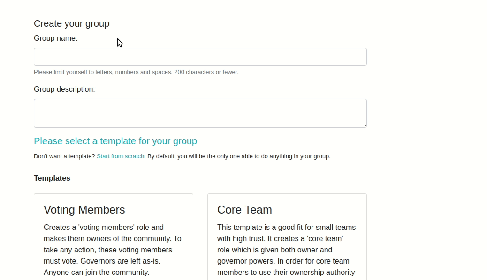
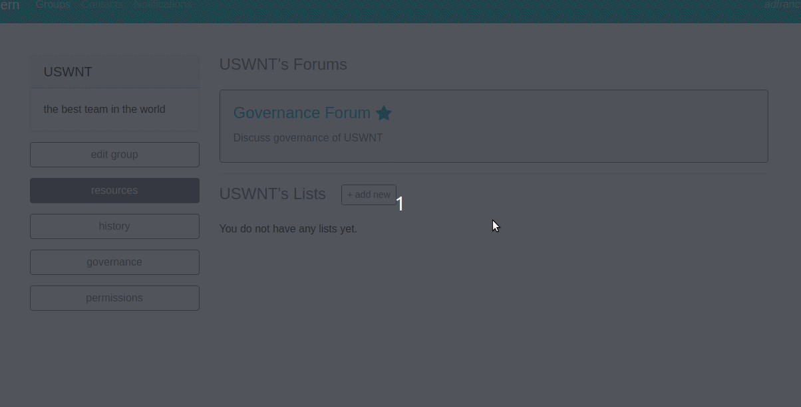

How to Add a Template
#####################

Concord's permissions system gives users very fine-grained control over permissions in thier communities, but it can be very difficult to build a desirable set of permissions up from scratch. Many, if not most, users will prefer to work from existing, familiar systems. Even users who are very comfortable adding and editing permissions, conditions, roles, etc will still benefit from having a library of templates to choose from.

To that end, Concord provides functionality for a "template library", that is a set of pre-existing structures that users can choose from and apply to their communities. The current template system is simplistic, and we hope to improve it in the future. In particular, we hope to add an interface so users can create their own templates via a web interface. For now, though, templates are added through code.

You can create new templates by adding them to any file called ``template_library.py`` that is in the top level of your Django app. The built-in templates from Concord are stored in ``concord/actions/template_library.py``. 

Templates are stored in a TemplateModel object and so to actually create new instances, you'll need to run ``python manage.py update_templates``. If you've edited an existing template, you can recreate all of the template models by running ``python manage.py update_templates --recreate``.

Example 1: Community Template
^^^^^^^^^^^^^^^^^^^^^^^^^^^^^

Let's add a template to the file. Our template will set up a leadership structure with a 'core team' that has a high level of trust. Because there's a high level of trust, the only condition set on owners will be a simple approval condition. All of our core team members will be governors as well.

To create a new template, start by importing ``TemplateLibraryObject`` from ``concord/actions/template_library.py`` and inheriting from that object:

.. code-block:: python

    class CommunityCoreTeamTemplate(TemplateLibraryObject):
        """Creates a template with core team as owners with an approval condition for foundational actions.
        Core team members are also set as governor. Also incldues 'anyone can join' permission."""  
        name = 
        description = 
        scopes =
        supplied_fields = 

        def get_action_list(self):

            client = self.get_client()

            return []

Let's start by filling out most of the class attributes. Name and description should be fairly straightforward. The name should be unique and do a decent job reflecting the template, though of course there are limits in how much nuance you can capture in a few words. With the description, do your best to explain what the template does in 'plain English'.  Users considering applying the template will also see a description of the actions that the template takes, but the description can help them understand what they're reading.

We can also specify the scope.  The scope determines where in the front-end the template is shown.  Our template applies community-wide so it will appear in the governance section of the front-end.  Community scopes are also made available when the user is creating their group.

We might fill out name, description and scope like this (we'll handled ``supplied_fields`` later):

.. code-block:: python

    class CommunityCoreTeamTemplate(TemplateLibraryObject):
        """Creates a template with core team as owners with an approval condition for foundational actions.
        Core team members are also set as governor. Also incldues 'anyone can join' permission."""  
        name = "Core Team"
        scopes = ["community"]
        description = """This template is a good fit for small teams with high trust. It creates a 'core team' role
                     which is given both owner and governor powers. In order for core team members to use their 
                     ownership authority one other core team member must approve. The template also allows anyone 
                     to join the community."""
        supplied_fields = {}

        def get_action_list(self):

            client = self.get_client()

            return []

Templates work by creating a series of "mock actions", returned by the method ``get_action_list``. These are then used when a template is applied to generate real actions which are taken on the target community. To generate these actions,we use our client in "mock" mode, which is handled by the ``get_client`` method inherited from ``TemplateLibraryObject``.

Our first step will be to add the 'core team' role:

.. code-block:: python

    def get_action_list(self):

        client = self.get_client()

        # Step 1: add 'core team'
        action_1 = client.Community.add_role(role_name="core team")
        action_1.target = "{{context.action.target}}"

When we make templates, we don't always know what the attributes of the action will be ahead of time. We can create placeholders in our mock actions via strings with the structure ``"{{placeholder_content}}"``.  The three types of placeholders reference the ``context`` (that is, the set of objects associated with the template, which always including the Apply Template action but often includes other objects), ``supplied_fields`` (data specified by the user when applying the template), and ``previous`` (a dictionary of the previous actions generated by the template and their results). Here, we're making the target of our action the target of the trigger action.

.. code-block:: python

        # Step 2: make initial people into 'core team'
        action_2 = client.Community.add_people_to_role(
            role_name="core team", people_to_add="{{supplied_fields.initial_core_team_members}}")
        action_2.target = "{{context.action.target}}"

Next, we add people to the core team role. Whoever applies the template will be asked to specify these people. Notice that again, we need to specify that the target of this action should be the community that the ApplyTemplate action was taken on. Also note that we've changed the name of the mock_action being created, so we don't overwrite the previous one.  At the end of this method, we'll be listing them all out in order, so we need to keep them separate.

The next step is to make the core team role into an ownership role:

.. code-block:: python

        # Step 3: make 'core team' role an ownership role
        action_3 = client.Community.add_owner_role(owner_role="core team")
        action_3.target = "{{context.action.target}}"

We also want to make it into a governorship role:

.. code-block:: python

        # Step 4: make 'core team' role an governorship role
        action_4 = client.Community.add_governor_role(governor_role="core team")
        action_4.target = "{{context.action.target}}"

Then we add a condition to the ownership role (though not the governing role):

.. code-block:: python

        # Step 5: add approval condition to ownership role
        permission_data = [{"permission_type": Changes().Conditionals.Approve, "permission_roles": ["core team"],
                            "permission_type": Changes().Conditionals.Reject, "permission_roles": ["core team"]}]
        action_5 = client.Community.add_leadership_condition(
            condition_type="approvalcondition", leadership_type="owner", permission_data=permission_data)
        action_5.target = "{{context.action.target}}"

Working with conditions takes a bit more configuration than other client calls. Here, we're controlling who has permission to update the condition by approving or rejecting the action that triggered it. Because conditions are themselves a type of template, we can configure them with placeholder strings as well, but we'll talk about this more in the next example. For now, the only placeholder we use is for the target, just like all the other actions in this template.

Finally, we'll let anyone join the group, but we don't give the members any special permissions by default:

.. code-block:: python

        # Step 6: add anyone can join permission
        action_6 = client.PermissionResource.add_permission(
            permission_type=Changes().Communities.AddMembers, anyone=True, permission_configuration={"self_only": True})
        action_6.target = "{{context.action.target}}"

Finally, we collect all our actions and return them:

.. code-block:: python

        return [action_1, action_2, action_3, action_4, action_5, action_6]

One thing you may be wondering is why we had to specify the mock action target each time. After all, it was always ``"{{context.action.target}}"``. And that's often (though not always) the case for template mock actions. To handle this, there's an optional attribute called ``default_action_target``, set by default to ``"{{context.action.target}}"``. If you don't set a mock action's target via ``mock_action.target``, it will automatically be set to whatever the default is. If you overwrite the default to set it to None, you will have to make sure to set each mock action target individually, or an error will be raised.

Given that we've got ``default_action_target`` to handle setting all our actions' targets to the default, we can remove all those references from ``get_action_list``.

The final step is to create our supplied fields.

.. code-block:: python

    supplied_fields = {
        "initial_core_team_members":
            ["ActorListField", {"label": "Who should the initial members of the core team be?", "required": True}]
    }

Supplied_fields is a dictionary with keys exactly the same as how they're referenced in our action placeholders. The value is a list, where the first item is always a string representing the type of field it is (ActorListField, RoleListField, CharField, IntegerField, or BooleanField), and the second is a dictionary with a variety of options. You should always provide a label for the field, which is what the user will see when applying your template. The other valid options vary depending on the type of field it is. For instance, integer fields accept a minimum and maximum argument, while others don't.  All accept the 'required' argument, which we use here.

Putting everything together, we get the following object:

.. code-block:: python

    class CommunityCoreTeamTemplate(TemplateLibraryObject):
        """Creates a template with core team as owners with an approval condition for foundational actions.
        Core team members are also set as governor. Also incldues 'anyone can join' permission."""
        name = "Core Team"
        scopes = ["community"]
        description = """This template is a good fit for small teams with high trust. It creates a 'core team' role
                        which is given both owner and governor powers. In order for core team members to use their 
                        ownership authority one other core team member must approve. The template also allows anyone 
                        to join the community."""
        supplied_fields = {
            "initial_core_team_members":
                ["ActorListField", {"label": "Who should the initial members of the core team be?", "required": True}]
        }

        def get_action_list(self):

            client = self.get_client()

            # Step 1: add 'core team'
            action_1 = client.Community.add_role(role_name="core team")

            # Step 2: make initial people into 'core team'
            action_2 = client.Community.add_people_to_role(
                role_name="core team", people_to_add="{{supplied_fields.initial_core_team_members}}")

            # Step 3: make 'core team' role an ownership role
            action_3 = client.Community.add_owner_role(owner_role="core team")

            # Step 4: make 'core team' role an governorship role
            action_4 = client.Community.add_governor_role(governor_role="core team")

            # Step 5: add approval condition to ownership role
            permission_data = [{"permission_type": Changes().Conditionals.Approve, "permission_roles": ["core team"],
                                "permission_type": Changes().Conditionals.Reject, "permission_roles": ["core team"]}]
            action_5 = client.Community.add_leadership_condition(
                condition_type="approvalcondition", leadership_type="owner", permission_data=permission_data)

            # Step 6: add anyone can join permission
            action_6 = client.PermissionResource.add_permission(
                permission_type=Changes().Communities.AddMembers, anyone=True, permission_configuration={"self_only": True})

            return [action_1, action_2, action_3, action_4, action_5, action_6]

Here's what our new template looks like on the front end:

Example 2: Resource Template
^^^^^^^^^^^^^^^^^^^^^^^^^^^^

Let's try another template, this one slightly more complex. This template will be for a resource object, simple list. You can learn more about simple lists :doc:`here<how_to_add_resource>` but the tl;dr is that they're ordered lists with configurable columns. The six types of state changes associated with simple lists are Add List, Edit List, Delete List, Add Row, Edit Row and Delete Row.  Our template will set permissions on an existing list, so we'll ignore the Add List permission.

Let's start with our actions this time:

.. code-block:: python

    def get_action_list(self):

            client = self.get_client()
            
            # Step 1: give members permission to add row
            action_1 = client.PermissionResource.add_permission(
                permission_roles=['members'], permission_type=Changes().Resources.AddRow)

            # Step 2: give members permission to edit list
            action_2 = client.PermissionResource.add_permission(
                permission_roles=['members'], permission_type=Changes().Resources.EditList)

The person who created the list likely wants to ability to review changes. This template will allow them to do so, by creating an approval condition and giving them permission to update the condition:

.. code-block:: python

        # Step 3: set approval condition on permission
        permission_data = [{"permission_type": Changes().Conditionals.Approve, 
                            "permission_actors": "{{nested:context.simplelist.creator||to_pk_in_list}}"},
                           {"permission_type": Changes().Conditionals.Reject, 
                            "permission_actors": "{{nested:context.simplelist.creator||to_pk_in_list}}"}]
        action_3 = client.PermissionResource.add_condition_to_permission(
            condition_type="approvalcondition", permission_data=permission_data
        )
        action_3.target = "{{previous.1.result}}"

Notice that we *are* explicitly setting the target of this action. That's because it's not the default target of ``{{context.action.target}}`` but instead the result of the previous action - that is, the permission we just created. To access this permission, we use the placeholder type ``previous``. Previous is zero-indexed, so we're getting not the result of the first action, but the result of the second. We use ``.result`` to indicate that we want to get the result of the action. To get the action itself, we'd use ``previous.1.action``.

When a condition is applied to a permission, it gets a lot of context from the permission object it's set on. We know the permission this condition is set on targets SimpleLst and so we know we'll have access to the target simplelist in the context. And we know that the attribute on simplelist we want to use is the creator.

The other thing to note is the ``permission_actors``. We use the placeholder action to indiciate who should have permission to approve or reject - the creator of the simplelist - but we don't want to make that substitution when we apply the template. Instead, we want the placeholder to carry through to the condition itself. We do this by using the ``nested:`` syntax.

Finally, note the ``||to_pk_in_list``. Sometimes we need to transform a piece of data to make it fit the field. Permission actors are stored as a list of pks, while accessing the attribute creator on simplelist will give us a
User object. There are a small number of transformations available in the placeholder syntax, always called at the 
end of a placeholder string and indicated with ``||``. ``to_pk_in_list`` assumes the value passed in has a pk, gets that pk, and puts it in a list, which is exactly what we want here.

Let's do the permissions & conditions for EditRow and DeleteRow. We can reuse the permission data for the two other conditions, because it's exactly the same for all three, but if we wanted to we could set different conditions.

.. code-block:: python

    # Step 4: give members permission to edit row
    action_4 = client.PermissionResource.add_permission(
        permission_roles=['members'], permission_type=Changes().Resources.EditRow)

    # Step 5: set approval condition on permission
    action_5 = client.PermissionResource.add_condition_to_permission(
        condition_type="approvalcondition", permission_data=permission_data
    )
    action_5.target = "{{previous.3.result}}"

    # Step 6: give members permission to edit row
    action_6 = client.PermissionResource.add_permission(
        permission_roles=['members'], permission_type=Changes().Resources.DeleteRow)

    # Step 7: set approval condition on permission
    action_7 = client.PermissionResource.add_condition_to_permission(
        condition_type="approvalcondition", permission_data=permission_data
    )
    action_7.target = "{{previous.5.result}}"

And that's it.  Here's the full Template object:

.. code-block:: python

    class SimpleListLimitedMemberTemplate(TemplateLibraryObject):
        """Creates permissions on a simplelist where members can add rows to the list without condition but can only 
        edit or delete rows, or edit the list itself, if the creator approves. Only the creator can delete the list."""
        name = "Limited Member Permissions"
        scopes = ["simplelist"]
        supplied_fields = {}
        description = """This template allows members to add rows to the list without needing approval. To edit or                      delete rows, or to edit the list itself, the creator must approve. Only the creator may 
                         delete the list."""

        def get_action_list(self):

            client = self.get_client()
            
            # Step 1: give members permission to add row
            action_1 = client.PermissionResource.add_permission(
                permission_roles=['members'], permission_type=Changes().Resources.AddRow)

            # Step 2: give members permission to edit list
            action_2 = client.PermissionResource.add_permission(
                permission_roles=['members'], permission_type=Changes().Resources.EditList)

            # Step 3: set approval condition on permission
            permission_data = [{"permission_type": Changes().Conditionals.Approve, 
                                "permission_actors": "{{nested:context.simplelist.creator||to_pk_in_list}}"},
                            {"permission_type": Changes().Conditionals.Reject, 
                                "permission_actors": "{{nested:context.simplelist.creator||to_pk_in_list}}"}]
            action_3 = client.PermissionResource.add_condition_to_permission(
                condition_type="approvalcondition", permission_data=permission_data
            )
            action_3.target = "{{previous.1.result}}"

            # Step 4: give members permission to edit row
            action_4 = client.PermissionResource.add_permission(
                permission_roles=['members'], permission_type=Changes().Resources.EditRow)

            # Step 5: set approval condition on permission
            action_5 = client.PermissionResource.add_condition_to_permission(
                condition_type="approvalcondition", permission_data=permission_data
            )
            action_5.target = "{{previous.3.result}}"

            # Step 6: give members permission to edit row
            action_6 = client.PermissionResource.add_permission(
                permission_roles=['members'], permission_type=Changes().Resources.DeleteRow)

            # Step 7: set approval condition on permission
            action_7 = client.PermissionResource.add_condition_to_permission(
                condition_type="approvalcondition", permission_data=permission_data
            )
            action_7.target = "{{previous.5.result}}"

            return [action_1, action_2, action_3, action_4, action_5, action_6, action_7]

Note that we're not taking any user input here, so we have no supplied fields. (If we wanted to make a custom role the moderator of member actions on the list, we'd have to have a supplied field to determine what role to use.)

The scope of a template targetting a specific resource type should be the name of the model exactly in lower case.

Here's what our new template looks like on the front end. Note that the template doesn't appear as an option when creating the group, only when editing our list permissions:

